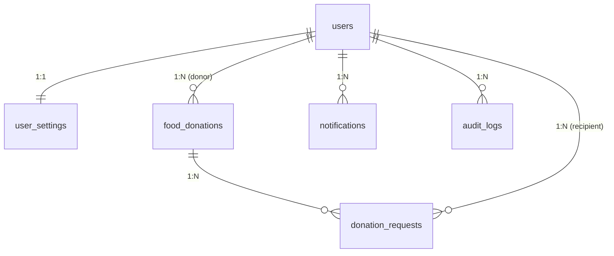

# RePlate — Food Donation & Redistribution Platform

RePlate is an enterprise-grade, web-based platform built to bridge the gap between commercial/community food donors and food assistance recipients. The system enables real-time donation listing, automated request processing, role-based user management, transaction audit logging, and automated SMTP notifications while strictly guarding user discretion and platform security.

---

## System Architectural Overview

RePlate is structured around a decoupled, modular RESTful API architecture running on PHP 8.2+ and MySQL/MariaDB 10.4+. The system isolates public entry points, enforcement wrappers, and configuration files to enforce the principle of least privilege.

---

### System Architectural Overview

RePlate is structured around a decoupled, modular RESTful API architecture running on PHP 8.2+ and MySQL/MariaDB 10.4+. The system isolates public entry points, enforcement wrappers, and configuration files to enforce the principle of least privilege.

```text
replate/
├── config/
│   ├── db.php # Database connection wrapper (PDO, ignored by Git)
│   ├── db.php.example # Database configuration template for deployment
│   ├── init.php # Session & global initialization bootstrapping
│   ├── mail.php # Socket-based SMTP mail driver (ignored by Git)
│   └── mail.php.example # SMTP mail configuration template
├── Security.php # Security header applier & rate-limiting engine
├── public/
│   ├── index.php # Primary API gateway and routing handler
│   ├── .htaccess # Apache rewrite rules for clean URL routing
│   ├── favicon.ico # Site icon resource
│   ├── api/
│   │   ├── activity.php # User activity metrics & log retrieval
│   │   ├── admin.php # System administration & user/donation management
│   │   ├── categories.php # Food category taxonomy handler
│   │   ├── donations.php # CRUD operations for food donation items
│   │   ├── forgot_password.php # Self-service OTP password recovery workflow
│   │   ├── notifications.php # User notification dispatch & management
│   │   ├── reports.php # Analytics, impact metrics, and reporting API
│   │   ├── requests.php # Claim request workflow & approval engine
│   │   ├── settings.php # User profile and discretion settings API
│   │   └── users.php # User authentication, registration, session management
│   ├── css/ # Modular UI stylesheets
│   ├── js/ # Frontend controllers & AJAX handlers
│   ├── activity.html # User activity log dashboard
│   ├── admin-dashboard.html # Administrative control center
│   ├── dashboard.html # User portal dashboard
│   ├── donations.html # Donation discovery & management page
│   ├── index.html # Platform landing page
│   ├── login.html # Authentication interface
│   ├── register.html # Registration page
│   ├── requests.html # Request management interface
│   └── settings.html # User preferences & profile settings
├── sql/
│   └── schema.sql # Primary DDL database creation script
├── .gitignore # Git exclusion specifications
├── Dockerfile # Apache/PHP container definition
├── README.md # Project documentation
├── replate_dump.sql # Production database seed data dump
└── router.php # Local development PHP built-in server router


---

## Entity-Relationship & Database Schema (ERD)

The MySQL database schema (`replate`) consists of six relational tables configured with strict foreign key constraints, indexes, and automatic transaction locks.



<details>
<summary>Click to view plain-text (ASCII) diagram</summary>

```text
+-------------------+         +-------------------+         +-------------------+
|       users       |         |   food_donations  |         | donation_requests |
+-------------------+         +-------------------+         +-------------------+
| PK user_id        |<--------| PK donation_id    |<--------| PK request_id     |
|    name           | (1:N)   | FK donor_id       | (1:N)   | FK donation_id    |
|    org_name       |         |    food_name      |         | FK recipient_id (users)|
|    email          |         |    quantity       |         |    quantity_requested |
|    password_hash  |         |    pickup_location|         |    status         |
|    role           |         |    status         |         |    created_at     |
|    status         |         |    created_at     |         +-------------------+
+-------------------+         +-------------------+
  |                             |
  | (1:1)                       | (1:N)
  v                             v
+-------------------+         +-------------------+         +-------------------+
|   user_settings   |         |   notifications   |         |     audit_logs    |
+-------------------+         +-------------------+         +-------------------+
| PK user_id        |         | PK id             |         | PK log_id         |
|    discretion     |         | FK user_id        |         | FK user_id        |
+-------------------+         |    title          |         |    event_type     |
|    message        |         |    action_details |         |                   |
|    is_read        |         |    ip_address     |         |                   |
+-------------------+         +-------------------+         +-------------------+
```

</details>

### Table Definitions

1. **`users`**
   * `user_id` (INT, Primary Key, Auto Increment)
   * `name` (VARCHAR 100, NOT NULL)
   * `org_name` (VARCHAR 255, NULL)
   * `email` (VARCHAR 255, UNIQUE, NOT NULL)
   * `normalized_email` (VARCHAR 150, UNIQUE, NOT NULL)
   * `password_hash` (VARCHAR 255, NOT NULL)
   * `role` (ENUM: `'recipient'`, `'donor'`, `'admin'`, DEFAULT `'recipient'`)
   * `status` (VARCHAR 50, DEFAULT `'Active'`)
   * `created_at` (TIMESTAMP, DEFAULT `CURRENT_TIMESTAMP`)

2. **`user_settings`**
   * `user_id` (INT, Primary Key, Foreign Key -> `users.user_id` ON DELETE CASCADE)
   * `discretion_mode` (TINYINT 1, DEFAULT `0`)
   * `updated_at` (TIMESTAMP, DEFAULT `CURRENT_TIMESTAMP ON UPDATE CURRENT_TIMESTAMP`)

3. **`food_donations`**
   * `donation_id` (INT, Primary Key, Auto Increment)
   * `donor_id` (INT, Foreign Key -> `users.user_id` ON DELETE CASCADE)
   * `food_name` (VARCHAR 255, NOT NULL)
   * `category_id` (INT, NULL)
   * `quantity` (VARCHAR 100, NOT NULL)
   * `pickup_location` (VARCHAR 255, NOT NULL)
   * `expiry_date` (DATETIME, NULL)
   * `status` (ENUM: `'Available'`, `'Reserved'`, `'Collected'`, `'Cancelled'`, DEFAULT `'Available'`)
   * `created_at` (TIMESTAMP, DEFAULT `CURRENT_TIMESTAMP`)

4. **`donation_requests`**
   * `request_id` (INT, Primary Key, Auto Increment)
   * `donation_id` (INT, Foreign Key -> `food_donations.donation_id` ON DELETE CASCADE)
   * `recipient_id` (INT, Foreign Key -> `users.user_id` ON DELETE CASCADE)
   * `quantity_requested` (VARCHAR 100, NOT NULL)
   * `status` (ENUM: `'Pending'`, `'Approved'`, `'Rejected'`, `'Cancelled'`, DEFAULT `'Pending'`)
   * `created_at` (TIMESTAMP, DEFAULT `CURRENT_TIMESTAMP`)

5. **`notifications`**
   * `id` (INT, Primary Key, Auto Increment)
   * `user_id` (INT, Foreign Key -> `users.user_id` ON DELETE CASCADE)
   * `title` (VARCHAR 255, NOT NULL)
   * `message` (TEXT, NOT NULL)
   * `type` (VARCHAR 50, DEFAULT `'info'`)
   * `is_read` (TINYINT 1, DEFAULT `0`)
   * `created_at` (TIMESTAMP, DEFAULT `CURRENT_TIMESTAMP`)

6. **`audit_logs`**
   * `log_id` (INT, Primary Key, Auto Increment)
   * `user_id` (INT, Foreign Key -> `users.user_id` ON DELETE SET NULL)
   * `event_type` (VARCHAR 100, NOT NULL)
   * `action_details` (TEXT, NOT NULL)
   * `log_type` (VARCHAR 20, DEFAULT `'info'`)
   * `ip_address` (VARCHAR 45, NOT NULL)
   * `created_at` (TIMESTAMP, DEFAULT `CURRENT_TIMESTAMP`)

---

## Detailed API Specification

All API endpoints return JSON payloads adhering to the following structure:
* **Success**: `{"success": true, "message": "...", "data": {...}}`
* **Failure**: `{"success": false, "error": "ERR_CODE: Descriptive error message"}`

### Authentication & User Management (`/api/users.php`)

| Method | Action Param | Description | Input Payload | Response Data |
| :--- | :--- | :--- | :--- | :--- |
| `POST` | `register` | Registers a new donor or recipient account | `email`, `password`, `name`, `role`, `org_name` | User session initialized, success object |
| `POST` | `login` | Authenticates existing user credentials | `email`, `password` | User details, session cookie set |
| `POST` | `logout` | Destroys active user session | None | `{"success": true}` |
| `GET` | `me` | Fetches active authenticated user details | None | User profile object |

### Password Recovery Workflow (`/api/forgot_password.php`)

| Method | Action Param | Description | Input Payload | Response Data |
| :--- | :--- | :--- | :--- | :--- |
| `POST` | `request_otp` | Generates 6-digit OTP and sends via SMTP | `email` | `{"success": true, "message": "OTP sent"}` |
| `POST` | `verify_otp` | Validates submitted OTP against session hash | `email`, `otp` | Reset token string |
| `POST` | `reset_password` | Updates account password given valid token | `token`, `new_password` | `{"success": true}` |

### Food Donation Lifecycle (`/api/donations.php`)

| Method | Query / Body Action | Description | Access Control | Output |
| :--- | :--- | :--- | :--- | :--- |
| `GET` | `action=available` | Lists available food donations | Public / Recipient | Array of available donations |
| `GET` | `action=my_donations` | Lists donations created by logged-in donor | Donor | Array of user donations |
| `POST` | `action=create` | Creates a new food listing | Donor | Created donation object |
| `POST` | `action=update` | Updates food listing details | Listing Owner | Updated donation object |
| `POST` | `action=delete` | Deletes or cancels a donation listing | Listing Owner / Admin | Success confirmation |

### Request & Claim Engine (`/api/requests.php`)

| Method | Action Param | Description | Transaction Logic |
| :--- | :--- | :--- | :--- |
| `GET` | `action=my_requests` | Retrieves claims submitted by active recipient | Joins `food_donations` and checks donor discretion setting |
| `GET` | `action=incoming` | Retrieves incoming claims for donor's listings | Joins recipient details |
| `POST` | `action=create` | Submits a new claim request for a donation | `SELECT ... FOR UPDATE` lock; prevents duplicate active claims |
| `POST` | `action=approve` | Approves claim, marks listing `'Collected'`, rejects other pending claims | Database transaction; sends SMTP and in-app notifications |
| `POST` | `action=reject` | Rejects specific request, leaves listing `'Available'` | Updates request status to `'Rejected'` |
| `POST` | `action=cancel` | Recipient cancels their pending claim request | Updates request status to `'Cancelled'` |

### Notification Management (`/api/notifications.php`)

| Method | Action Param | Description |
| :--- | :--- | :--- |
| `GET` | N/A (`limit=50`)| Retrieves user notifications ordered by `created_at DESC` |
| `POST` | `mark_read` | Sets `is_read = 1` for specific `notification_id` |
| `POST` | `mark_all_read` | Sets `is_read = 1` for all notifications belonging to `user_id` |
| `POST` | `clear_all` | Purges all notifications for active user |

---

## Security Implementation Specifications

RePlate incorporates multi-layered application security headers, connection isolation, and anti-abuse safeguards:

1. **SQL Injection Guard**:
   * All database interactions strictly execute via PHP Data Objects (PDO) with prepared statements and bound parameter types (`PDO::ATTR_EMULATE_PREPARES => false`).

2. **Cross-Site Scripting (XSS) Prevention**:
   * Output encoding is applied to user-supplied text rendered on HTML templates using `htmlspecialchars(..., ENT_QUOTES, 'UTF-8')`.

3. **Rate Limiting Engine (`config/Security.php`)**:
   * Session-backed rate limits protect sensitive state-changing endpoints from brute-force attack vectors:
     * Authentication: 5 attempts / 300 seconds
     * Request creation: 15 submissions / 300 seconds
     * Notification actions: 30 calls / 60 seconds

4. **HTTP Security Headers**:
   ```http
   X-Frame-Options: DENY
   X-Content-Type-Options: nosniff
   X-XSS-Protection: 1; mode=block
   Referrer-Policy: strict-origin-when-cross-origin
   Content-Security-Policy: default-src 'self'; script-src 'self' 'unsafe-inline'; style-src 'self' 'unsafe-inline';

5. **Credential Protection**:
    * Passwords are hashed using `PASSWORD_BCRYPT` with auto-managed salt rounds. Session cookies are configured with `HttpOnly`, `SameSite=Lax`, and `Secure` (in HTTPS environments).

---

## Environment Setup & Installation Guide

### Prerequisites

* PHP 8.2 or higher
* MySQL 10.4 / MariaDB
* Apache / Nginx Web Server with `mod_rewrite` enabled
* Docker Desktop (Optional for containerized setup)

### Step-by-Step Local Deployment

1. **Clone the Repository**:
```bash
git clone (https://github.com/mahneeofficial/replate.git)
cd replate


1. **Database Initialization:**
   * Create a MySQL database named `replate`.
   * Import the SQL schema and seed data:
     ```bash
     mysql -u root -p replate < sql/schema.sql
     mysql -u root -p replate < sql/replate_dump.sql
     ```

2. **Configure Local Environment Files:**
   * Copy environment configuration templates to active configurations:
     ```bash
     cp config/db.php.example config/db.php
     cp config/mail.php.example config/mail.php
     ```
   * Open `config/db.php` and set your database connection parameters:
     ```php
     $host = '127.0.0.1';
     $db   = 'replate';
     $user = 'root';
     $pass = 'YOUR_LOCAL_MYSQL_PASSWORD'; // Set your local DB password here
     ```
   * Open `config/mail.php` and set your Gmail SMTP App Password for automated emails:
     ```php
     define('MAIL_USER', 'your-email@gmail.com');
     define('MAIL_PASS', 'your-16-character-app-password');
     ```


3. **Web Server Setup**:
   * Point your web server document root to the `replate/public/` directory.
   * Verify that Apache has `mod_rewrite` enabled to support standard router behavior via `.htaccess`.

### Containerized Deployment (Docker)

To deploy RePlate using Docker:

1. **Build Container Image**:
   ```bash
   docker build -t replate-app .

2. **Execute Docker Container:**
   ```bash
   docker run -d -p 8080:80 \
     -e DB_HOST=host.docker.internal \
     -e DB_NAME=replate \
     -e DB_USER=root \
     -e DB_PASS=YOUR_LOCAL_MYSQL_PASSWORD \
     --name replate_container replate-app


3. **Access Platform Interface:**
   * Navigate to `http://localhost:8080` in your web browser.


### Error & System Logging Reference

| Error Code | Category | Cause / Resolution |
| :--- | :--- | :--- |
| `ERR_SYS_00` | Configuration | Database configuration file missing or PDO connection failure. Check `config/db.php`. |
| `ERR_SYS_01` | System | Internal server exception thrown. Check PHP error logs in `logs/` directory. |
| `ERR_AUTH_01` | Authentication | Action attempted without an active session. Prompt user login. |
| `ERR_AUTH_02` | Authorization | User lacks adequate role permissions to modify target resource. |
| `ERR_REQ_01` | Claim Workflow | Listing is no longer `'Available'`. |
| `ERR_REQ_03` | Claim Workflow | Donor attempted to request their own listed donation. |
| `ERR_REQ_04` | Claim Workflow | Recipient already has an active pending claim for the item. |
| `ERR_VAL_01` | Validation | Missing required payload parameters or input validation check failed. |


## Maintenance & Testing Commands

To run sanity checks and clear local cache:

```bash
# Check PHP Syntax across all endpoint scripts
find public/api/ -name "*.php" -exec php -l {} \;

# Check active database logs
tail -n 100 /var/log/apache2/error.log

```

## License & Project Attribution
Designed and built for the RePlate Food Redistribution Project. Distributed under the MIT License.


## Author

* **Brian Kimani** - [@mahneeofficial](https://github.com/mahneeofficial)